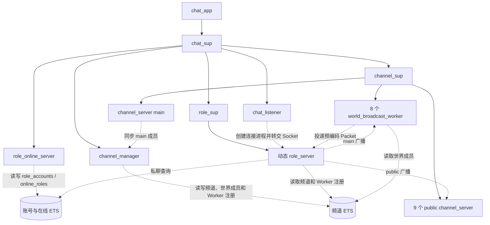
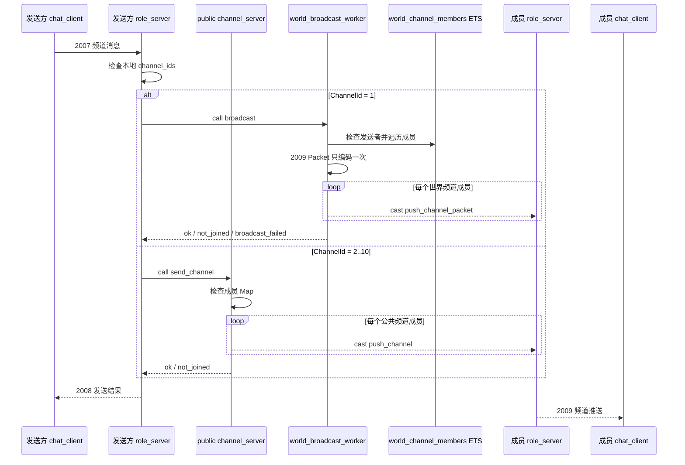

# Chat V1\.1 设计文档

### 修改历史

|日期|修改内容|
|---|---|
|2026\-07\-28|项目改名为 `chat`；调整服务端和客户端模块；完善登录、固定频道、私聊、ETS 数据、TCP 协议及运行流程设计。|
|2026\-07\-30|重构客户端为普通消息驱动的独立行为进程；删除客户端业务的同步 `call`、`From`、延迟 `reply`、请求忙碌限制和业务辅助函数；补充客户端状态、异步操作流程、断线处理及验收说明。|
|2026\-08\-03|将 `chat_client_manager` 改为按 ClientId 管理客户端的 `client`；增加范围创建、频道发送和按 ClientId 私聊接口；客户端登录后自动定时向 `main` 发送消息。|
|2026\-08\-04|服务端 Socket 改为 `{active, true}`；`main` 频道增加 8 个固定广播 Worker 和世界频道成员 ETS；增加独立观察者、广播失败结果及性能限制说明；普通客户端自动发送间隔改为 3000ms。|

## **1\. 项目目标**

使用 Erlang/OTP 实现一个简单的 TCP 聊天程序。项目名为 `chat`，服务端和客户端都由本项目实现。

V1\.1 只完成三个基础功能：

- 登录

- 多频道聊天

- 在线角色私聊


## **2\. 整体架构**

### **2\.1 进程架构图**

实线表示 Supervisor 的启动和监督关系，虚线表示业务调用或数据访问关系。



核心进程职责：

- 一个 role\_server 对应一个在线玩家和一条 TCP 连接。

- role\_online\_server 管理账号和在线角色。

- channel\_manager 管理频道资料、世界频道成员和世界广播 Worker 的 ETS 表。

- 每个 channel\_server 独立管理自己的频道成员；`main` 频道同时把成员同步到世界频道成员 ETS。

- 8 个 world\_broadcast\_worker 只处理 `main` 全量广播；9 个公共频道仍由各自的 channel\_server 广播。

- 频道聊天和私聊由玩家 role\_server 主动发起。


### **2\.2 主要消息流程图**

登录过程中，role\_online\_server 只处理账号和在线状态。频道加入由玩家 role\_server 直接调用对应的 channel\_server。



世界频道中，发送方 RoleId 通过 `phash2` 固定选择一个 Worker。Worker 完成对当前世界频道成员的邮箱投递后才返回，但成功只表示 cast 已进入各个 `role_server` 邮箱，不表示客户端 Socket 已经收到消息。

`channel_manager` 进程不串行处理广播；Worker PID 和世界频道成员都由调用方直接读取 ETS。加入、退出和进程监控清理仍由 `main channel_server` 同步这些 ETS 数据。


私聊不会经过 role\_online\_server 的消息邮箱。发送方 role\_server 直接读取 online\_roles ETS，再把私聊消息发送给目标 role\_server。


## 3\. 技术约定和项目目录

### 3\.1 技术约定

- 使用单个 Erlang 节点和单个 OTP Application。

- 服务端和客户端通过 TCP 长连接通信。

- 使用 `gen_tcp`，不引入第三方网络库。

- Socket 使用 `{packet, 4}` 处理 TCP 半包和粘包。

- `role_online_server`、`role_server`、`channel_manager`、`channel_server`、`world_broadcast_worker` 和 `chat_client` 使用 `gen_server`。

- 使用 Supervisor 管理固定服务、频道进程、玩家进程和客户端进程。

- 业务进程通过 `gen_server:call/2`、`gen_server:cast/2` 或普通消息通信，不传递 `fun` 执行业务。

- 使用 ETS 保存账号、在线角色、频道资料、世界频道成员和世界广播 Worker 注册信息。

- ETS 中的数据使用 record，方便以后增加字段。

- 每个 `role_server` 使用进程字典保存当前玩家自己的业务状态。

- 暂不使用 `rebar3`，通过 `erlc` 和 Shell 脚本编译、启动。

- V1\.1 不增加心跳、空闲超时和没有实际用途的定时任务。


### 3\.2 项目目录

```Plain Text
chat/
├── src/
│   ├── server/
│   │   ├── chat.app.src
│   │   ├── chat_app.erl
│   │   ├── chat_sup.erl
│   │   ├── chat_listener.erl
│   │   ├── role_sup.erl
│   │   ├── role_server.erl
│   │   ├── role_online_server.erl
│   │   ├── chat_server_protocol.erl
│   │   ├── channel_sup.erl
│   │   ├── channel_manager.erl
│   │   ├── channel_server.erl
│   │   └── world_broadcast_worker.erl
│   └── client/
│       ├── chat_client_sup.erl
│       ├── client.erl
│       ├── chat_client.erl
│       └── chat_client_protocol.erl
├── include/
│   ├── chat_protocol.hrl
│   └── chat_record.hrl
├── ebin/
├── scripts/
│   ├── compile.sh
│   ├── start_server.sh
│   └── start_client.sh
├── README.md
├── Chat V1.1 接口文档.md
└── Chat V1.1 设计文档.md
```


### 3\.3 公共头文件

`chat_protocol.hrl` 保存客户端和服务端共用的 `ProtoId`、`ResultCode` 和 `ChannelType`。

`chat_record.hrl` 保存服务端数据 record：

```Plain Text
role_account
online_role
channel_info
channel_state
channel_member
world_channel_member
world_broadcast_worker
```

客户端只需要包含协议头文件，不直接读取服务端 ETS。


### 3\.4 模块改名说明

```Plain Text
chat_connection_sup.erl -> role_sup.erl
chat_connection.erl     -> role_server.erl
旧 role_server.erl       -> role_online_server.erl
```

新设计中不再保留 `chat_connection` 这个模块名。一个 TCP 连接对应一个玩家主体，因此由 `role_server` 同时负责玩家状态和 Socket。


## 4\. 模块和监督设计

### 4\.1 服务端模块

|模块|类型|主要职责|
|---|---|---|
|`chat_app`|application|启动服务端根监督进程 `chat_sup`|
|`chat_sup`|supervisor|按顺序启动所有服务端固定进程|
|`chat_listener`|gen\_server|监听 TCP 端口；收到连接后启动 `role_server` 并转交 Socket|
|`role_sup`|supervisor|动态监督玩家进程，一个连接对应一个 `role_server`|
|`role_server`|gen\_server|代表一个在线玩家；持有 Socket 和玩家状态；处理登录、频道聊天和私聊|
|`role_online_server`|gen\_server|创建账号、验证密码、分配 RoleId、管理在线角色 ETS|
|`chat_server_protocol`|普通模块|解码客户端请求，编码服务端结果和消息推送|
|`channel_sup`|supervisor|监督 `main`、8 个世界广播 Worker 和 9 个公共频道进程|
|`channel_manager`|gen\_server|创建并维护频道资料、世界频道成员和世界广播 Worker 注册 ETS|
|`channel_server`|gen\_server|管理一个频道的成员和监控；公共频道直接广播，`main` 同步世界成员 ETS|
|`world_broadcast_worker`|gen\_server|校验世界频道发送者，编码一次 `2009` Packet，并向全部世界频道成员邮箱投递|

服务端进程结构：

```Plain Text
chat_app
└── chat_sup
    ├── role_online_server
    ├── channel_manager
    ├── channel_sup
    │   ├── channel_server main
    │   ├── 8 个 world_broadcast_worker
    │   └── 9 个 public channel_server
    ├── role_sup
    │   └── 动态 role_server
    └── chat_listener
```

固定服务和固定频道进程使用 `permanent`。动态玩家进程 `role_server` 使用 `temporary`，断线后不使用旧 Socket 自动重启。

一个 `role_server` 对应：

```Plain Text
一个在线玩家
一个 RoleId
一个 RoleName
一条 TCP 长连接
一份玩家进程字典
```

主要业务路径：

```Plain Text
登录：
role_server -> role_online_server

main 频道聊天：
role_server -> world_broadcast_worker -> world_channel_members ETS
            -> 成员 role_server

public 频道聊天：
role_server -> channel_server -> 成员 role_server

私聊：
role_server -> online_roles ETS -> 目标 role_server
```

`channel_manager` 保存世界频道广播所需的成员和 Worker 注册 ETS，但它的 gen\_server 邮箱不经过每条广播。公共频道仍由各自的 `channel_server` 保存成员并完成广播。`main channel_server` 保存成员和监控，并在加入、退出或 `DOWN` 时同步 `world_channel_members`。


### 4\.2 客户端模块

|模块|类型|主要职责|
|---|---|---|
|`chat_client_sup`|supervisor|监督 `client` 管理进程和动态客户端进程|
|`client`|gen\_server|维护 ClientId 与客户端 PID 的对应关系，提供观察者、范围创建、频道发送和私聊接口|
|`chat_client`|gen\_server|代表一个完整的客户端用户，持有一条 TCP 长连接，自主处理登录、频道操作、聊天和网络消息|
|`chat_client_protocol`|普通模块|编码客户端请求，解码服务端结果和推送|

每个 `chat_client` 都是一个独立客户端角色，拥有自己的 Socket、连接状态、RoleId、RoleName 和 ChannelIds。Shell 或其他进程只向它发送登录、频道操作和聊天等普通消息；`chat_client` 在 `handle_info/2` 中识别消息并调用对应的 `do_*` 函数，再自行发送 TCP 请求、处理服务端响应和更新内部状态。

`client` 只负责 ClientId 查找和客户端生命周期管理。它找到客户端 PID 后发送普通消息，不替客户端编码协议或处理聊天行为，也不为每个客户端增加额外的行为进程。`chat_client` 使用 `temporary`，连接结束后不自动重启。

调用 `client:start_client(StartId, EndId)` 可以按闭区间串行创建普通客户端。每个 ClientId 对应一个 `chat_client`，账号名为 `client_N`，密码固定为 `123456`，创建后自动发送登录消息。登录成功后，普通客户端使用 `send_after` 每隔 3000ms 向自己发送一次自动频道动作；每次动作完成后再安排下一次，不增加行为进程，也不打印业务结果和频道推送。

调用 `client:start_observer()` 可以独立创建一个观察者客户端，固定账号名为 `observer_001`。观察者登录后不自动发送消息，只接收并逐条打印频道推送，同时周期输出：

```Plain Text
observer=observer_001 received=N invalid=M
```

`received` 是上次报告后已经由观察者进程处理并打印的频道推送数，`invalid` 是协议解码失败数。报告消息与 TCP 消息共用观察者邮箱，逐条 `io:format` 也是同步 I/O，因此邮箱或终端积压时报告不保证严格对应一个自然秒，也不能单独作为服务端实时吞吐量。


## 5\. 数据设计

### 5\.1 record 定义

服务端数据 record 放在 `include/chat_record.hrl`：

```Erlang
-record(role_account, {
    role_name,
    role_id,
    password
}).

-record(online_role, {
    role_name,
    role_id,
    role_pid,
    monitor_ref
}).

-record(channel_info, {
    channel_id,
    channel_type,
    channel_name,
    channel_pid
}).

-record(channel_state, {
    channel_id,
    channel_type,
    channel_name,
    members = #{},
    member_monitors = #{}
}).

-record(channel_member, {
    role_id,
    role_pid,
    monitor_ref
}).

-record(world_channel_member, {
    role_id,
    role_pid
}).

-record(world_broadcast_worker, {
    worker_index,
    worker_pid
}).
```


### 5\.2 账号和在线角色 ETS

`role_online_server` 创建两张 `named_table set` ETS。record 的第一个元组元素是 record 名称，因此使用 `keypos` 明确业务主键：

```Erlang
ets:new(role_accounts, [
    named_table,
    set,
    private,
    {keypos, #role_account.role_name}
]).

ets:new(online_roles, [
    named_table,
    set,
    protected,
    {keypos, #online_role.role_name}
]).
```

`role_accounts` 保存 RoleName、RoleId 和密码，只有 `role_online_server` 可以读写。`online_roles` 保存当前在线的 RolePid，`role_online_server` 负责写入和删除，其他 `role_server` 可以读取它查找私聊目标。

登录规则：

- RoleName 不存在时，使用本次密码创建新账号并分配 RoleId。

- RoleName 已存在且离线时，密码正确即可使用原 RoleId 登录。

- 密码错误返回 `invalid_login`。

- RoleName 已在线时返回 `already_online`。

- V1\.1 不持久化 ETS，服务端重启后账号数据重新开始。

    

### 5\.3 频道资料和成员状态

`channel_manager` 创建三张 `protected named_table set`：

```Erlang
ets:new(channel_info, [
    named_table,
    set,
    protected,
    {keypos, #channel_info.channel_id}
]),

ets:new(world_channel_members, [
    named_table,
    set,
    protected,
    {keypos, #world_channel_member.role_id},
    {read_concurrency, true}
]),

ets:new(world_broadcast_workers, [
    named_table,
    set,
    protected,
    {keypos, #world_broadcast_worker.worker_index},
    {read_concurrency, true}
]).
```

`channel_info` 保存固定频道的 ID、类型、名称和最新 ChannelPid。`world_channel_members` 保存当前 `main` 成员的 RoleId 与 RolePid，供世界广播 Worker 直接遍历。`world_broadcast_workers` 保存 `1..8` 到 WorkerPid 的注册关系，供发送方按索引查找 Worker。

服务端固定创建 `1 = main`，以及 `2` 到 `10 = public_1` 到 `public_9`。每个 `channel_server` 在自己的 `#channel_state.members` Map 中保存成员：

```Erlang
Members = #{
    RoleId => #channel_member{
        role_id = RoleId,
        role_pid = RolePid,
        monitor_ref = MonitorRef
    }
}.
```

`#channel_state.member_monitors` 额外保存 `MonitorRef => RoleId`，收到 `DOWN` 时可以直接定位并删除成员，不扫描完整成员 Map。

加入成功后，`channel_server` 监控 RolePid。主动退出时删除成员并取消监控；RolePid 退出时通过 `DOWN` 删除成员。公共频道成员只保存在各自进程状态中；`main channel_server` 还会把加入和清理结果同步到 `world_channel_members`。`main channel_server` 启动时清空旧的世界成员表，避免自身重启后保留失效 RolePid。

世界广播 Worker 启动时把 `WorkerIndex` 和自己的 PID 写入 `world_broadcast_workers`。Worker 是 `permanent` 子进程，重启后会用同一索引覆盖旧 PID。


### 5\.4 role\_server 玩家状态

Socket 保存在 `role_server` 的 `gen_server State` 中。登录成功后，玩家业务状态写入当前进程的进程字典：

```Erlang
put(role_id, RoleId),
put(role_name, RoleName),
put(channel_ids, #{
    1 => true,
    3 => true,
    7 => true
}).
```

`channel_ids` 只保存已加入的 ChannelId，不长期缓存 ChannelPid。发送消息时先检查自己的`channel_ids`，再读取 `channel_info` ETS 取得最新 ChannelPid。加入或退出成功后同步更新 `channel_ids`，断线后进程字典随 `role_server` 一起消失。


## 6\. 接口和进程消息

### 6\.1 服务端接口

|接口|方式|返回值或作用|
|---|---|---|
|`role_sup:start_role()`|Supervisor API|`{ok, RolePid} | {error, Reason}`|
|`role_online_server:login(RolePid, RoleName, Password)`|`call`|`{ok, RoleId} | {error, Reason}`|
|`channel_manager:register_channel(ChannelId, Type, Name, ChannelPid)`|`call`|`ok`，登记固定频道|
|`channel_manager:register_world_worker(WorkerIndex, WorkerPid)`|`call`|`ok`，登记世界广播 Worker|
|`channel_manager:add_world_member(RoleId, RolePid)`|`call`|`ok`，写入世界频道成员|
|`channel_manager:remove_world_member(RoleId)`|`call`|`ok`，删除世界频道成员|
|`channel_manager:reset_world_members()`|`call`|`ok`，清空世界频道成员|
|`channel_manager:world_worker(WorkerIndex)`|ETS 读取|`{ok, WorkerPid} | error`|
|`channel_server:join(ChannelPid, RoleId, RolePid)`|`call`|`{ok, ChannelId} | {error, already_joined}`|
|`channel_server:leave(ChannelPid, RoleId)`|`call`|`{ok, ChannelId} | {error, Reason}`|
|`channel_server:send_channel(ChannelInfo, RoleId, RoleName, Content)`|分流接口|`{ok, ChannelId} | {error, Reason}`|
|`world_broadcast_worker:send(RoleId, RoleName, Content)`|`call`|`{ok, 1} | {error, not_joined | broadcast_failed}`|

`role_server` 读取 `channel_info` 后调用 `channel_server:send_channel/4` 分流。`main` 按以下规则选择固定的 8 个 Worker 之一：

```Erlang
WorkerIndex = erlang:phash2(SenderRoleId, 8) + 1.
```

同一发送者固定进入同一个 Worker。Worker 先检查发送者是否在 `world_channel_members`，再把 `2009` Packet 编码一次并遍历 ETS，向每个成员投递已经编码的 Packet：

```Erlang
gen_server:cast(MemberRolePid, {push_channel_packet, Packet}).
```

Worker 完成整次 ETS 遍历后才回复发送方 `role_server`。查不到 Worker，或 `gen_server:call/2` 因 `timeout`、`noproc` 等原因退出时，调用端统一转换为 `{error, broadcast_failed}`，随后通过 `2008` 返回客户端，不让一次广播失败直接杀死发送者 `role_server`。

公共频道仍由对应 `channel_server` 检查成员 Map、遍历成员并发送结构化消息：

```Erlang
gen_server:cast(MemberRolePid, {
    push_channel,
    ChannelId,
    SenderRoleId,
    SenderRoleName,
    Content
}).
```

发送私聊时，发送方 `role_server` 直接读取 `online_roles` ETS。目标在线时向目标玩家进程发送：

```Erlang
gen_server:cast(TargetRolePid, {
    push_private,
    SenderRoleId,
    SenderRoleName,
    Content
}).
```

世界频道的目标 `role_server` 直接发送 Worker 已编码的 Packet；公共频道和私聊的目标 `role_server` 收到结构化消息后调用 `chat_server_protocol` 编码。三种推送最终都通过目标进程自己的 Socket 发送。


### 6\.2 role\_server 处理关系

|客户端请求|role\_server 的处理|
|---|---|
|登录|`call role_online_server`；成功后直接加入固定频道|
|查询频道|读取 `channel_info` ETS，并结合自己的 `channel_ids` 返回|
|加入频道|读取 ChannelPid，`call channel_server`，成功后更新进程字典|
|退出频道|读取 ChannelPid，`call channel_server`，成功后更新进程字典|
|`main` 频道聊天|本地检查后按 SenderRoleId 选择 Worker；Worker 校验 ETS、编码一次并全量投递；根据结果发送 `2008`|
|公共频道聊天|本地检查后 `call channel_server`；频道进程校验成员 Map 并广播；根据结果发送 `2008`|
|私聊|读取 `online_roles`，cast 给目标 RolePid，再发送 `3002`|

`role_online_server` 监控登录成功的 RolePid，并在收到 `DOWN` 后删除 `online_roles`。每个 `channel_server` 也独立监控自己的成员，并在收到 `DOWN` 后删除成员。


### 6\.3 客户端接口

客户端对外接口：

|接口|返回值|
|---|---|
|`client:start_client(StartId, EndId)`|`{ok, Count} | {error, Reason}`|
|`client:start_observer()`|`ok | {error, Reason}`|
|`client:send_channel(ClientId, ChannelId, Content)`|`ok | {error, Reason}`|
|`client:send_private(SenderId, TargetId, Content)`|`ok | {error, Reason}`|

`client` 找到对应 PID 后使用以下内部消息驱动 `chat_client`：

|对外接口|内部消息|
|---|---|
|`start_client/2`|`{login, RoleName, Password}`|
|`start_observer/0`|`{login, <<"observer_001">>, Password}`|
|`send_channel/3`|`{send_channel, ChannelId, Content}`|
|`send_private/3`|`{send_private, TargetRoleName, Content}`|

`send_channel/3` 或 `send_private/3` 返回 `ok`，只表示消息已经交给对应客户端，不表示 TCP 请求或服务端业务已经成功。

`chat_client` 在 `handle_info/2` 中处理业务消息并发送 TCP 请求。服务端结果稍后以 `{tcp, Socket, Packet}` 进入同一个客户端邮箱，客户端解码后自行更新连接状态、RoleId、RoleName 和 ChannelIds。

客户端不再通过 `handle_call/3` 接收业务操作，不保存调用者 `From`，也不使用 `gen_server:reply/2`。由于没有外部同步调用者等待结果，客户端不需要使用 `pending` 把 TCP 响应关联回某次 `gen_server:call`，也不再限制为同时只能存在一个等待回复的业务操作。

普通客户端使用 `normal` 模式：登录后每隔 3000ms 自动向 `main` 发送消息，但不打印登录结果、发送结果或收到的推送。观察者使用 `observer` 模式：不启动自动发送，只逐条打印 `2009` 频道推送、累计 `received`，协议解码失败时累计 `invalid`，并周期打印汇总。当前观察者忽略 `3003` 私聊推送，不用于验证私聊。


## 7\. TCP 二进制协议

### 7\.1 外层格式和字段

服务端监听和接收 Socket 时使用 `[binary, {packet, 4}, {active, false}]`。完成 Socket 控制权转交后，`role_server` 改为 `{active, true}`；客户端连接 Socket 从创建时就使用 `{active, true}`。网络格式为：

```Erlang
<<PacketLength:32, ProtoId:16, Data/binary>>
```

`PacketLength` 由 `gen_tcp` 自动添加和去除，业务代码处理 `<<ProtoId:16, Data/binary>>`。Socket 持续把收到的完整业务包作为 `{tcp, Socket, Packet}` 消息投递给控制进程，不需要在处理每个包后重新激活。

`{active, true}` 省去了 `{active, once}` 每处理一包就调用 `inet:setopts/2` 的切换开销，适合当前阶段直接测试处理上限；代价是 Socket 层不提供基于进程邮箱的流量控制。发送速度超过 `role_server` 或 `chat_client` 的处理速度时，TCP 消息会与业务消息一起在进程邮箱中积压，增加内存占用和处理延迟。当前版本接受这个限制，不设置邮箱上限或主动降速。

|字段|位数|
|---|---|
|`ProtoId`|16|
|`ResultCode`|8|
|`RoleId`|32|
|`ChannelId`|32|
|字符串长度|16|
|频道数量|16|

整数使用默认大端序，字符串和聊天内容使用 UTF\-8 binary。位于报文末尾的 `Password` 或 `Content` 不再增加长度字段，由 `{packet, 4}` 的完整报文边界确定结束位置。


### 7\.2 ProtoId

|ProtoId|含义|ProtoId|含义|
|---|---|---|---|
|1001|登录请求|1002|登录结果|
|2001|查询频道请求|2002|查询频道结果|
|2003|加入频道请求|2004|加入频道结果|
|2005|退出频道请求|2006|退出频道结果|
|2007|发送频道消息|2008|频道发送结果|
|2009|推送频道消息|3001|发送私聊|
|3002|私聊发送结果|3003|推送私聊|
|9001|通用错误|||


### 7\.3 登录

```Erlang
请求：<<1001:16, NameLength:16, RoleName:NameLength/binary, Password/binary>>
成功：<<1002:16, 0:8, RoleId:32, ChannelCount:16, ChannelIds/binary>>
失败：<<1002:16, ResultCode:8>>
```

`ChannelIds` 由 `ChannelCount` 个 32 位 `ChannelId` 组成。结果码：`0 = success`、`1 = invalid_login`、`2 = already_online`。


### 7\.4 查询频道

```Erlang
请求：<<2001:16>>
结果：<<2002:16, ChannelCount:16, ChannelList/binary>>
频道项：<<ChannelId:32, ChannelType:8, Joined:8,
          NameLength:16, ChannelName:NameLength/binary>>
```

`ChannelType`：`1 = main`、`2 = public`；`Joined`：`0 = 未加入`、`1 = 已加入`。


### 7\.5 加入和退出频道

```Erlang
加入请求：<<2003:16, ChannelId:32>>
加入结果：<<2004:16, ResultCode:8, ChannelId:32>>
退出请求：<<2005:16, ChannelId:32>>
退出结果：<<2006:16, ResultCode:8, ChannelId:32>>
```

加入结果码：`0 = success`、`1 = invalid_channel`、`2 = already_joined`。退出结果码：`0 = success`、`1 = invalid_channel`、`2 = not_joined`、`3 = cannot_leave_main`。


### 7\.6 频道聊天

```Erlang
发送：<<2007:16, ChannelId:32, Content/binary>>
结果：<<2008:16, ResultCode:8, ChannelId:32>>
推送：<<2009:16, ChannelId:32, SenderRoleId:32,
        SenderNameLength:16,
        SenderRoleName:SenderNameLength/binary, Content/binary>>
```

结果码：`0 = success`、`1 = invalid_channel`、`2 = not_joined`、`3 = broadcast_failed`。

客户端不发送自己的身份。发送方 `role_server` 从进程字典取得发送者信息，并先检查自己是否加入了该频道。`main` 由世界广播 Worker 再检查 `world_channel_members`，公共频道由对应 `channel_server` 再检查成员 Map；检查成功后向频道全部当前成员投递 `2009`，包括发送者本人。`broadcast_failed` 表示世界广播 Worker 不存在或调用失败，不表示某个具体接收客户端的 Socket 发送失败。


### 7\.7 私聊

```Erlang
发送：<<3001:16, TargetNameLength:16,
        TargetRoleName:TargetNameLength/binary, Content/binary>>
结果：<<3002:16, ResultCode:8, TargetNameLength:16,
        TargetRoleName:TargetNameLength/binary>>
推送：<<3003:16, SenderRoleId:32, SenderNameLength:16,
        SenderRoleName:SenderNameLength/binary, Content/binary>>
```

私聊使用 `TargetRoleName` 查找目标玩家，不要求客户端知道对方的 `RoleId`。结果码：`0 = success`、`1 = target_offline`。成功表示在 `online_roles` 中找到了目标 `RolePid`，并向目标 `role_server` 发出了推送消息，不表示对方已经阅读。


### 7\.8 通用错误

```Erlang
<<9001:16, RequestProtoId:16, ErrorCode:8>>
```

错误码：`1 = not_logged_in`、`2 = invalid_packet`、`3 = unknown_proto`。`9001` 只处理无法进入具体业务流程的通用错误。加入频道、退出频道和发送频道消息产生的错误，分别通过 `2004`、`2006` 和 `2008` 返回。


## 8\. 主要运行流程

### 8\.1 服务端启动

1. `chat_app` 启动根监督进程 `chat_sup`。

2. `role_online_server` 创建账号表 `role_accounts` 和在线表 `online_roles`。

3. `channel_manager` 创建 `channel_info`、`world_channel_members` 和 `world_broadcast_workers`。`channel_sup` 依次启动 `main channel_server`、8 个世界广播 Worker 和 9 个公共频道进程；频道登记资料，Worker 登记索引与 PID。

4. `role_sup` 准备动态监督玩家进程，`chat_listener` 开始监听 TCP 端口。

    

### 8\.2 接收连接

1. `chat_listener` 使用 `gen_tcp:accept/1` 等待连接，不设置定时唤醒。

2. 接收 Socket 后，调用 `role_sup:start_role()` 启动一个等待 Socket 的 `role_server`。

3. `chat_listener` 使用 `gen_tcp:controlling_process/2` 把 Socket 控制权转交给该 `role_server`。

4. 转交成功后发送 `{socket_ready, Socket}`；`role_server` 保存 Socket，并设置 `{active, true}` 持续接收数据。

5. 任一步骤失败都关闭新 Socket；成功后 `chat_listener` 继续等待下一个连接。

    

### 8\.3 登录

1. Shell 或其他进程向客户端发送 `{login, RoleName, Password}` 普通消息，发送表达式立即返回。

2. `chat_client` 在 `handle_info/2` 中收到登录消息，调用 `do_login/3` 编码并发送 `1001`，然后把自己的连接状态更新为 `logging_in`。客户端进程不等待服务端结果，继续处理邮箱中的其他消息。

3. 服务端 `role_server` 收到 `1001`，解码出 `RoleName` 和 `Password`，再 `call role_online_server`。

4. 新 RoleName 自动创建账号并分配 RoleId；已有账号检查密码和在线状态。

5. 登录成功后，`role_online_server` 写入 `online_roles` 并监控 RolePid。

6. `role_server` 加入必须进入的 `main`，再随机加入 1 到 3 个不同的公共频道。

7. `role_server` 把 RoleId、RoleName 和 ChannelIds 写入自己的进程字典，并返回 `1002`。

8. `chat_client` 收到 `{tcp, Socket, Packet}` 后解码 `1002`。登录成功时把状态更新为 `online`，保存 RoleId、RoleName 和 ChannelIds。普通客户端安排 3000ms 后的第一次自动发送；观察者安排周期报告。

9. 登录失败时，服务端通过 `1002` 返回对应结果码并保留 TCP 连接。客户端把状态恢复为 `connected`，清理未成功的角色数据，之后可以再次接收登录消息。只有观察者模式打印结果。

登录结果始终由 `chat_client` 自己处理，不通过 `gen_server:reply/2` 返回给发送登录消息的进程。客户端 Socket 使用 `{active, true}`，持续接收 TCP 报文，不需要在每条报文处理完成后重新激活。

    

### 8\.4 频道操作和频道聊天

- 查询频道：Shell 向客户端发送 `list_channels`。`chat_client` 调用 `do_list_channels/1` 发送 `2001`；`role_server` 读取 `channel_info`，结合自己的 `channel_ids` 通过 `2002` 返回全部 10 个频道及加入状态。客户端收到成功结果后，按频道列表中的 `joined` 字段重建自己的 ChannelIds。

- 加入频道：Shell 向客户端发送 `{join_channel, ChannelId}`。`chat_client` 调用 `do_join_channel/2` 发送 `2003`；`role_server` 取得 ChannelPid 并 `call channel_server`，通过 `2004` 返回结果。服务端和客户端都只在加入成功时把 ChannelId 加入自己的频道状态；加入 `main` 时还会同步 `world_channel_members`。

- 退出频道：Shell 向客户端发送 `{leave_channel, ChannelId}`。`chat_client` 调用 `do_leave_channel/2` 发送 `2005`；`role_server` 取得 ChannelPid 并 `call channel_server`，通过 `2006` 返回结果。服务端和客户端都只在退出成功时从自己的频道状态中删除 ChannelId；`main` 不允许退出。

- 发送 `main` 消息：`chat_client` 发送 `2007`；`role_server` 检查自己的 `channel_ids`，再按 SenderRoleId 固定选择世界广播 Worker。Worker 检查世界成员 ETS、编码一次 `2009`、遍历成员并 cast `{push_channel_packet, Packet}`，完成邮箱投递后回复。`role_server` 根据结果返回 `2008`；Worker 调用失败时返回 `broadcast_failed`，发送方进程继续存活。

- 发送公共频道消息：`role_server` 检查自己的 `channel_ids` 后调用对应 `channel_server`。频道进程检查自己的成员 Map，向成员 cast 结构化 `{push_channel, ...}`，再回复发送方；各目标 `role_server` 分别编码并发送 `2009`。

以上操作都以普通消息进入 `chat_client:handle_info/2`。客户端发送 TCP 请求后不等待结果，可以继续处理邮箱中的其他客户端命令和频道推送；对应的服务端结果到达后，再由客户端自己的 `handle_info/2` 更新状态。普通客户端保持静默，观察者只打印自己处理的结果和频道推送。

频道加入和退出不通过 `channel_manager` 邮箱转发，但 `main channel_server` 会调用它同步世界成员 ETS。广播消息也不进入 `channel_manager` 邮箱；世界 Worker 直接读取 ETS，公共频道直接读取自己的成员 Map。发送者本身属于目标频道时，也会像其他成员一样收到 `2009` 推送。


### 8\.5 私聊

1. 调用 `client:send_private(SenderId, TargetId, Content)` 后，`client` 找到发送方 PID，并把 TargetId 转为目标账号名。发送方 `chat_client` 调用 `do_send_private/3` 编码并发送 `3001`，然后继续处理自己的邮箱。

2. 发送方 `role_server` 收到 `3001`，按 `TargetRoleName` 直接读取 `online_roles` ETS，不经过 `role_online_server` 的消息队列。

3. 找到目标 RolePid 后，发送方 `role_server` 向目标 `role_server` cast 结构化私聊消息，并通过自己的 Socket 向发送方客户端返回 `3002` 成功结果。

4. 目标 `role_server` 收到 cast 后编码 `3003`，通过自己持有的 Socket 推送给目标客户端。目标 `chat_client` 收到并解码 `3003`；当前普通模式和观察者模式都不打印私聊推送。

5. 发送方 `chat_client` 收到并解码 `3002`。这个结果由发送方客户端自己处理，不回复最初发送普通消息的 Shell 进程；普通客户端保持静默。

6. 目标不在线时，发送方 `role_server` 通过 `3002` 返回 `target_offline`，不会产生 `3003` 推送。发送方客户端处理结果后继续处理后续消息。

    

### 8\.6 断开连接

1. 当前不提供单个客户端的对外停止接口。客户端 VM 结束、Socket 关闭或客户端异常时，`chat_client` 进入断开流程。

2. `chat_client` 在 `handle_info/2` 中收到 `stop` 后正常结束，并在终止过程中关闭自己持有的 Socket。发生 `{tcp_closed, Socket}` 或 `{tcp_error, Socket, Reason}` 时，客户端也会结束；客户端进程退出后不会由 `chat_client_sup` 自动重启。

3. 客户端 Socket 关闭后，服务端对应的 `role_server` 收到断开消息并结束。高负载时，它的邮箱中可能已经存在大量待推送广播；在处理到断开消息前调用 `gen_tcp:send/2` 可能先返回 `closed` 或 `einval`，此时 `role_server` 以 `{tcp_send_failed, Reason}` 退出。

4. `role_online_server` 收到监控 `DOWN` 后删除该玩家的 `online_roles` 记录；各个 `channel_server` 分别收到自己的监控 `DOWN`，通过 `MonitorRef => RoleId` 删除成员。`main channel_server` 同时从 `world_channel_members` 删除该角色。账号表 `role_accounts` 不删除。

5. 玩家再次连接时会创建新的 `chat_client` 和 `role_server`。使用原账号登录会复用原 RoleId，并重新加入 `main` 和随机公共频道。


## 9\. 编译、启动和验收

### 9\.1 编译和启动

```Plain Text
scripts/compile.sh      -> 编译 server/client，准备 ebin/chat.app
scripts/start_server.sh -> application:start(chat)
scripts/start_client.sh -> chat_client_sup:start_link()
```

先在一个终端编译并启动服务端：

```Bash
./scripts/compile.sh
./scripts/start_server.sh
```

再在另一个终端启动客户端 Shell：

```Bash
./scripts/start_client.sh
```

客户端 Shell 先独立启动观察者，再使用 ClientId 创建和操作普通客户端：

```Erlang
ok = client:start_observer().
{ok, 2} = client:start_client(1, 2).
ok = client:send_channel(1, 1, <<"hello">>).
ok = client:send_private(1, 2, <<"hello">>).
```

`start_observer/0` 与普通客户端范围创建互相独立。观察者使用固定账号 `observer_001`，只接收频道消息，不参与自动发送。普通客户端保持静默；观察者逐条打印频道推送，并输出 `received` 和 `invalid` 汇总。


### 9\.2 V1\.1 验收

1. 服务端正常启动 `role_online_server`、`channel_manager`、`main`、8 个世界广播 Worker 和 9 个公共频道进程，并监听 TCP 端口；三张频道 ETS 均已创建，8 个 Worker 均已登记。

2. `client:start_observer/0` 独立创建并登录 `observer_001`；`client:start_client/2` 按闭区间串行创建普通客户端并自动发送登录消息。新账号第一次登录时取得 RoleId，断开后使用已有账号登录时复用原 RoleId。

3. 密码错误时客户端处理 `invalid_login` 并保持连接，之后可以再次接收登录消息；同一账号重复在线时处理 `already_online`。普通客户端不打印结果。

4. 登录成功后，服务端角色一定加入 `main` 和 1 到 3 个不同的随机公共频道；客户端收到 `1002` 后进入 `online` 状态，并保存相同的 RoleId、RoleName 和 ChannelIds。

5. 向客户端发送频道查询、加入和退出消息后，客户端能异步处理对应结果；查询返回全部 10 个频道，公共频道可以加入和退出，`main` 不能退出，客户端与服务端的 ChannelIds 保持一致。

6. 向 `main` 发送消息时，同一 SenderRoleId 固定进入同一个世界广播 Worker；Worker 只编码一次 Packet，并向 `world_channel_members` 的全部 RolePid 投递。发送方处理 `2008`，成员处理 `2009`，观察者打印收到的频道消息。

7. 向公共频道发送消息时仍由该频道 `channel_server` 广播，非成员收不到推送。未加入频道时发送方处理 `not_joined`；发送者本人属于频道成员时也能收到 `2009`。

8. 世界广播 Worker 不存在、退出或调用超时时，发送方处理 `broadcast_failed`，发送方 `role_server` 和 TCP 连接不因这次 Worker 调用失败而退出。Worker 进程退出时由监督树重新启动并重新登记；只有调用超时时，Worker 不会因此自动重启。

9. 向客户端发送私聊消息后，在线目标客户端处理 `3003` 推送，发送方客户端处理 `3002` 结果；目标离线时发送方处理 `target_offline`。

10. 连续向同一个客户端发送多个普通业务消息时，消息由客户端邮箱依次接收，不会因为前一个 TCP 结果尚未到达而拒绝新消息。客户端停止或断线后，`online_roles`、频道成员 Map 和 `world_channel_members` 中的记录都被清理，其他在线客户端不受影响。

    

### 9\.3 V1\.1 限制

- 不实现独立注册接口；新账号只在第一次登录时自动创建。

- 不实现密码加密、账号持久化、聊天记录和离线私聊。

- 不创建、删除或回收频道，不实现频道权限、邀请、踢人和群主。

- 不实现地图、移动、AOI、地图聊天和周围聊天。

- 不实现心跳和空闲超时。

- 普通客户端固定每 3000ms 向 `main` 发送一条消息；当前不提供单个客户端的循环启动、停止、模式切换或发送频率控制接口。

- 批量客户端由 `client:start_client/2` 严格串行创建。返回 `{ok, Count}` 才表示完整范围已创建；任一连接失败会停止后续创建并返回失败 ClientId。

- 服务端和客户端 Socket 使用 `{active, true}`，没有进程邮箱级流控。高负载时 TCP、广播和报告消息可能持续积压，增加内存与延迟。

- 世界频道每条消息仍需遍历全部在线成员，单条复杂度为 O(N)。当 N 个客户端都按固定频率发送时，总投递量为 O(N²)；8 个 Worker 只拆分广播入口，不减少总投递数，也不解决下游 `role_server` 邮箱和 Socket 发送压力。

- Worker 成功只表示广播 cast 已投递到当时的成员邮箱，不表示所有客户端已经收到。当前不批量合并广播，也不对慢成员丢弃或降速。

- 观察者按要求逐条同步 `io:format` 所有频道消息。终端速度不足时，观察者邮箱和显示内容会滞后；`received` 是实际处理数，不是严格的服务端每秒发送量。

- 高负载下客户端突然退出时，服务端可能继续处理已积压的广播并向关闭 Socket 发送，产生 `{tcp_send_failed, closed | einval}` 终止报告。监控最终仍会清理在线和频道成员记录。

- `main channel_server` 重启时会清空 `world_channel_members`，当前在线角色不会自动重新加入；当前版本不保证固定服务进程崩溃后的完整业务状态恢复。

- 客户端断开后不自动重连，必须重新创建客户端进程。

- TCP 业务协议不包含 RequestId，客户端不向外部提供逐请求同步返回或回调关联。

- 只要求基础业务跑通，不处理其他服务进程崩溃后的完整业务状态恢复。


后续版本再考虑广播批处理、邮箱流控、慢客户端策略、可靠性能统计、地图和 AOI 等功能。批量测试仍由每个 `chat_client` 执行自己的行为，不为每个客户端增加额外的行为驱动进程。
