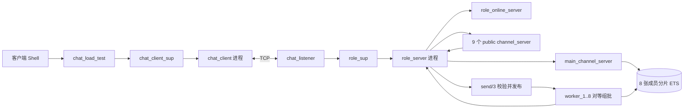
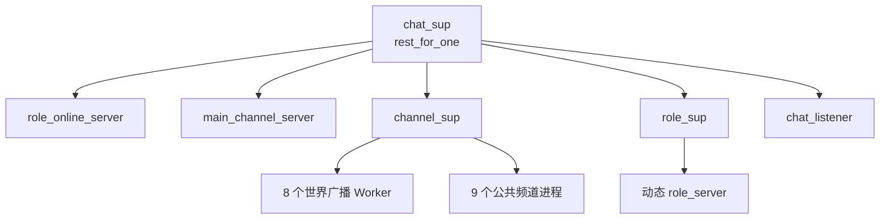
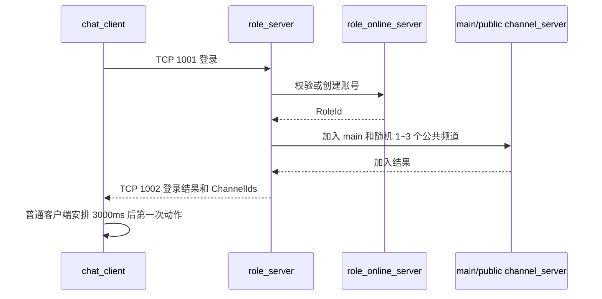
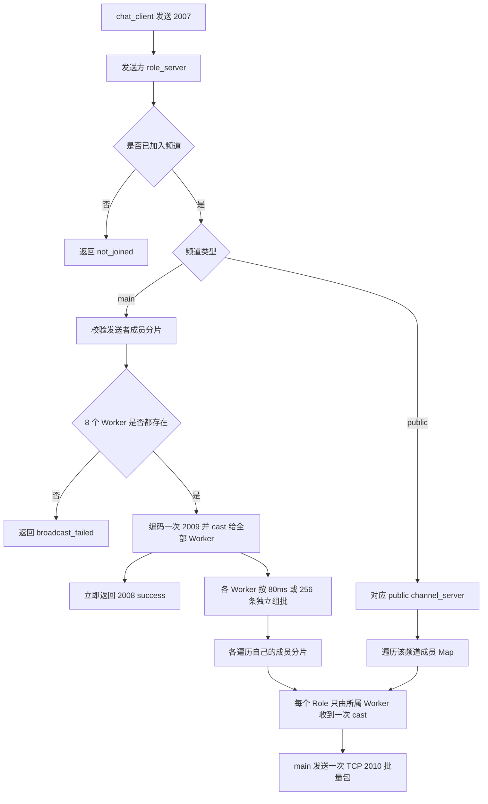
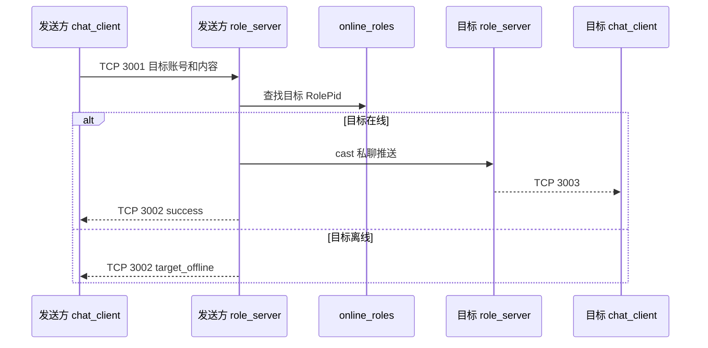
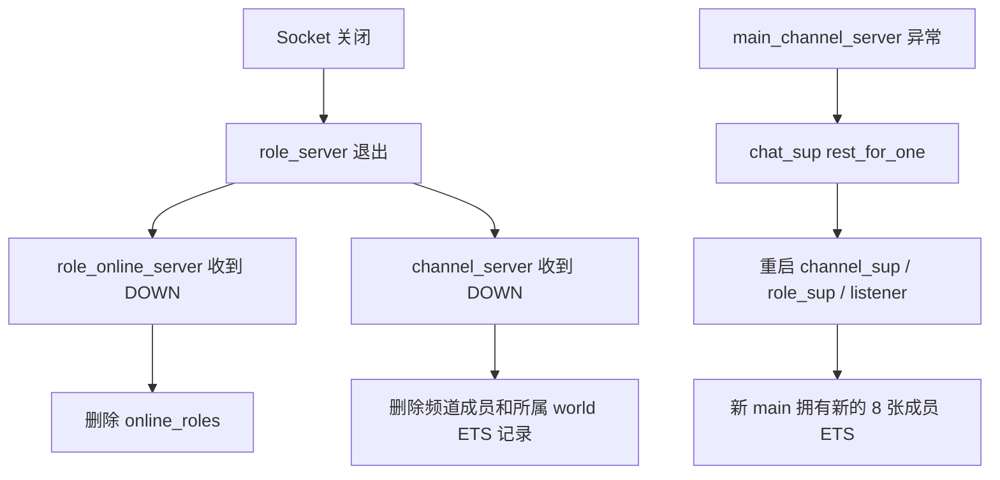

# Chat V1.2 设计文档

## 1. 版本说明

V1.2 是当前维护版本。它在 V1.1 基础上删除了客户端和频道管理中间层，精简了无用状态，增加了可重复运行的真实 TCP 全链路检查，并将世界广播改为 8 个对等接收者分片的异步协议批量 fan-out。

docs中的 V1.1 设计和接口文档只作为历史记录保留，不再更新。本文以当前代码和 `./scripts/full_chain_check.sh` 的验证结果为准。

## 2. 当前目标

- 使用 Erlang/OTP 和 `gen_tcp` 实现单节点聊天服务。
- 支持登录、固定频道、世界聊天、公共频道聊天和私聊。
- 每个 TCP 连接由独立 `role_server` 处理。
- 每个压测客户端独立连接、登录并执行自己的行为。
- 保持流程直接，避免只做转发的管理进程。

当前 `80ms/256 条` 对等分片在本机使用 1 个服务端 VM 和 1 个客户端 VM，通过 10000 客户端约一分钟混合负载；客户端保持完整批量解包，Role、Worker 和客户端邮箱均未持续积压。详细过程和数据见 [Chat V1.2 调优报告](<Chat V1.2 调优报告.md>)。该结果不代表其他机器、真实网络或长时间运行的容量上限。

## 3. 总体架构



主要职责：

| 模块 | 职责 |
|---|---|
| `chat_listener` | 监听端口，接受连接并交给新的 `role_server` |
| `role_online_server` | 保存账号和当前在线角色 |
| `role_server` | 处理一个连接的登录、频道、私聊和单次批量 TCP 推送 |
| `channel_server` | 管理固定频道定义和频道成员 |
| `world_broadcast_worker` | 8 个对等 Worker 独立组批，只向自己的接收者分片 fan-out |
| `chat_client` | 维护一个客户端连接，自行登录和执行行为 |
| `chat_load_test` | 批量启动客户端，并把 Shell 命令直接发给目标客户端 |
| `chat_metrics` | 按需读取连接数、邮箱长度和 BEAM 资源数据 |

## 4. 监督树



`chat_sup` 的子进程顺序很重要。`main_channel_server` 异常时，`rest_for_one` 会同时重启后面的频道监督树、角色监督树和监听器。旧连接会关闭，避免旧角色继续使用一张刚重建的空成员表。

## 5. 状态归属

| 数据 | Owner | 说明 |
|---|---|---|
| `role_accounts` | `role_online_server` | 账号、RoleId 和登录凭据 |
| `online_roles` | `role_online_server` | 当前在线 RoleName 到 RolePid |
| `world_channel_members_1..8` | `main_channel_server` | `main` 当前成员按 RoleId 哈希唯一分片，对应 Worker 只读 |
| 公共频道成员 | 对应 `channel_server` | 保存在进程 State Map 中 |
| 登录角色和已加入频道 | 对应 `role_server` | 只在该连接进程内使用 |
| 压测 ClientId 范围和已加入频道 | 对应 `chat_client` | 用于随机私聊、join 和 leave；频道最多 10 个，使用 List |

不存在 `channel_manager`、频道资料 ETS、Worker 注册 ETS 或客户端管理 GenServer。

## 6. 主要流程

### 6.1 登录



登录成功后一定加入 `main`，并随机加入 1 到 3 个不同的公共频道。观察者登录后不自动发送。

### 6.2 频道消息



`main` 的 `2008 success` 表示发送者已通过成员校验、8 个 Worker 在发布前均存在，并已向它们发出异步 cast，不表示接收者已经收到。每个 Worker 独立按 80ms 或 256 条组批，把已编码的 `2009` 消息包装成 `2010`，只遍历自己的成员 ETS。RoleId 通过 `phash2(RoleId, 8) + 1` 固定落入唯一分片，因此每个目标 Role 对一个批次只调用一次 `gen_tcp:send/2`。同一发送者到同一 Worker 的顺序保留，不同发送者之间不承诺全局统一顺序。公共频道仍由目标 `role_server` 分别编码并发送单条 `2009`。两条路径都会向频道内的发送者本人推送。

### 6.3 私聊



### 6.4 断线与故障恢复



发布前缺少任意世界 Worker 时，发送方收到 `broadcast_failed`，不会故意只发布到部分分片，`role_server` 也不会因此退出。成功响应后若 Worker 在刷批前崩溃，该分片的内存批次可能丢失；当前协议不承诺接收者送达。成员 ETS 属于 `main_channel_server`，所以 Worker 重启后仍可读取已有成员。

## 7. 客户端使用

```erlang
ok = chat_load_test:start_observer().
{ok, 2} = chat_load_test:start(1, 2).
ok = chat_load_test:send_channel(1, 1, <<"hello">>).
ok = chat_load_test:send_private(1, 2, <<"hello">>).
```

- `chat_load_test` 是普通模块，不是进程，也不保存 ClientId 到 PID 的 Map。
- 普通客户端登录成功后每 3000ms 随机执行一次动作：40% `main`、40% 私聊、10% join、10% leave。
- 私聊目标从本次 `start(StartId, EndId)` 范围随机选择并排除自己；没有目标或可用 join/leave 时退化为 `main`。
- 每个普通客户端保存登录返回及后续成功 join/leave 更新的小型 ChannelId List；频道总数固定为 10，不引入额外 Set。
- 所有普通客户端使用相同间隔，代码不增加首次错峰。
- observer 只接收并打印频道推送，每秒输出已处理数和无效包数。
- Shell 接口返回 `ok` 只表示命令已交给客户端，不代表服务端业务已经成功。

## 8. 协议摘要

TCP 使用 `[binary, {packet, 4}, {active, true}]`。业务包中的整数使用默认大端序。

| 功能 | 请求 | 返回/推送 |
|---|---:|---:|
| 登录 | 1001 | 1002 |
| 查询频道 | 2001 | 2002 |
| 加入频道 | 2003 | 2004 |
| 退出频道 | 2005 | 2006 |
| 频道聊天 | 2007 | 2008 / 2009 / 2010 |
| 私聊 | 3001 | 3002 / 3003 |
| 通用错误 | - | 9001 |

具体二进制字段以 `include/chat_protocol.hrl`、`chat_server_protocol` 和 `chat_client_protocol` 为准，避免在文档中维护第二套协议真相。

对 `main` 而言，`2008 success` 只确认校验和向全部本地 Worker 的异步发布。`2010` 是批量推送外层，内部每项带 32 位长度并保存一条完整 `2009`；客户端验证数量、长度和消息类型后逐条处理。公共频道继续直接推送 `2009`。

## 9. 验证方式

```bash
./scripts/compile.sh
./scripts/full_chain_check.sh
```

全链路检查使用系统选择的空闲回环端口，覆盖：

- 登录成功、密码错误、重复在线和未登录请求。
- 频道列表、加入、退出、非法频道和未加入频道。
- 世界频道 `2010` 批量 Packet、公共频道 `2009` 和私聊 `3003` 的实际接收结果。
- 批量包内多条 `2009` 的顺序、长度校验、单次 TCP 应用包发送和真实客户端逐条消费。
- 目标离线与断线后的 ETS/成员清理。
- 8 张成员 ETS 的唯一分片、owner、成员清理和汇总计数。
- 同一发送者的世界消息顺序和每个接收者只收到一份。
- 任意世界 Worker 停止时的 `broadcast_failed`，以及恢复后继续读取已有成员。
- 真实 `chat_client` 的 ClientId 范围、频道 List 更新、手工发送与三秒动作循环。
- main 异常后的 `rest_for_one` 重启和 ETS owner 恢复。

## 10. 性能验证

压测使用 1 台物理机、1 个服务端 BEAM VM 和 1 个客户端 BEAM VM，没有启用 Erlang 分布式节点。10000 个 `chat_client` 全部由同一个客户端 VM 启动，通过本机 TCP 连接服务端。

每个普通客户端每 3 秒执行一次动作：40% `main`、40% 私聊、10% join、10% leave。理论平均约为 1333 条世界消息/秒、1333 万次世界消息逻辑接收/秒；`80ms` 组批后，每个 Role 平均每秒接收约 12.5 个 `2010`，每批约 107 条 `2009`。这些是按概率计算的理论值，不是端到端累计计数。

| 批次配置 | 负载档位 | 约一分钟结果 |
|---|---:|---|
| `20ms/64 条` | 5000、6500 | 通过 |
| `20ms/64 条` | 8000 | Role 队列从 283880 增至约 15 秒的 2574426，失败并止损 |
| `100ms/256 条` | 8000、9000、10000 | 均通过 |
| `80ms/256 条` | 10000 | 通过，选为最终参数 |

最终 10000 档创建耗时 17.175258 秒。首次、约 15～20 秒、约 30 秒和约 60 秒的 Role 队列总量为 10/9/0/1，单 Role 最大不超过 1，Worker 队列始终为 0，服务端内存为 169.179/193.609/206.090/217.184 MiB。客户端完整解包，邮箱总量为 32/20/24/13，单客户端最大为 1，最终内存约 2046.501 MiB。完整数据和调优时间线见 [Chat V1.2 调优报告](<Chat V1.2 调优报告.md>)。

## 11. 当前限制

- `{active, true}` 没有邮箱背压，过载时消息可能在进程邮箱中积压。
- 每个 Worker 每批只遍历约八分之一成员，但总 fan-out 和网络数据量仍约为发送者数乘接收者数。
- 同一批逻辑消息会由 8 个 Worker 分别编码为 `2010`，换取并行扫描和投递。
- 成功响应后的 Worker 内存批次没有持久化，Worker 在刷批前崩溃可能丢失该分片消息。
- 当前没有应用层心跳，静默断网不能立即发现。
- 大批客户端突然退出时可能产生 `tcp_send_failed` Supervisor 日志，监控最终仍会清理成员。
- observer 的打印速度和计数不代表服务端全局吞吐量。
- 当前没有单客户端停止自动循环的公开接口，压测通常通过停止客户端 VM 结束。
- 10000 结果来自同机回环 TCP 和约一分钟观察，不能直接外推为生产环境或长期容量。
