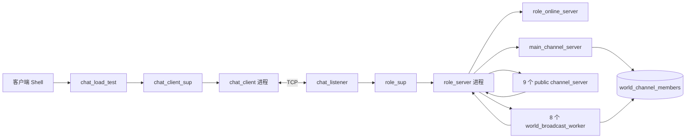
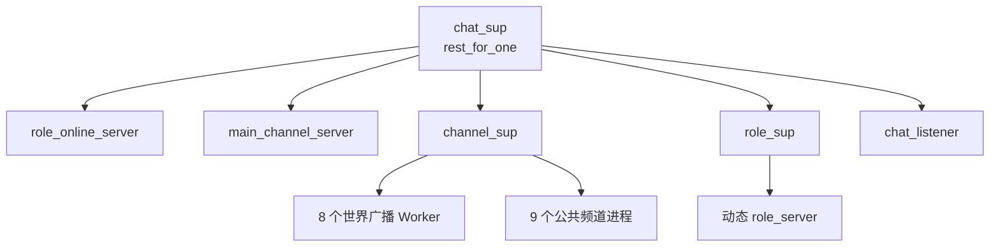
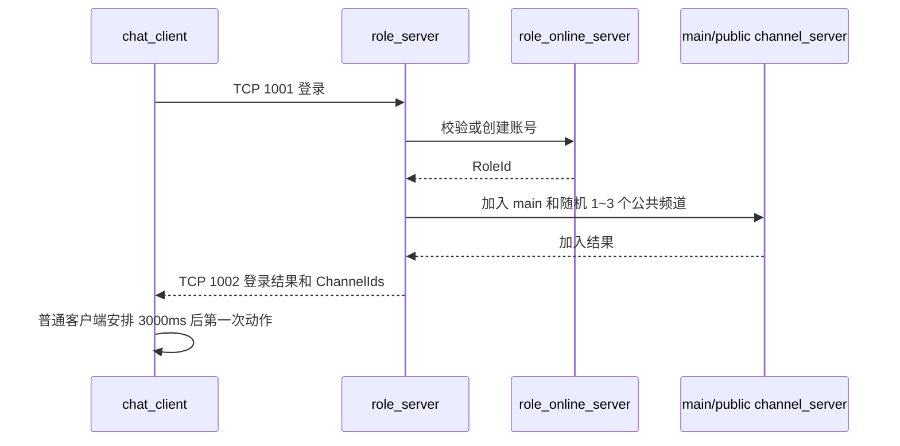
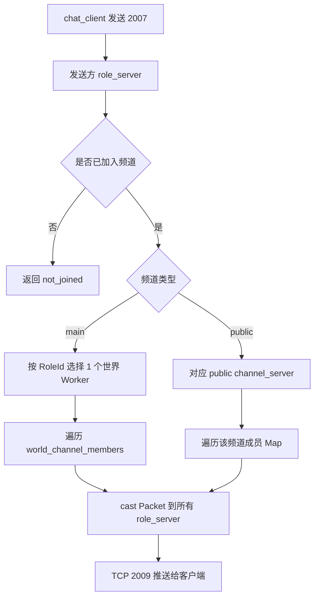
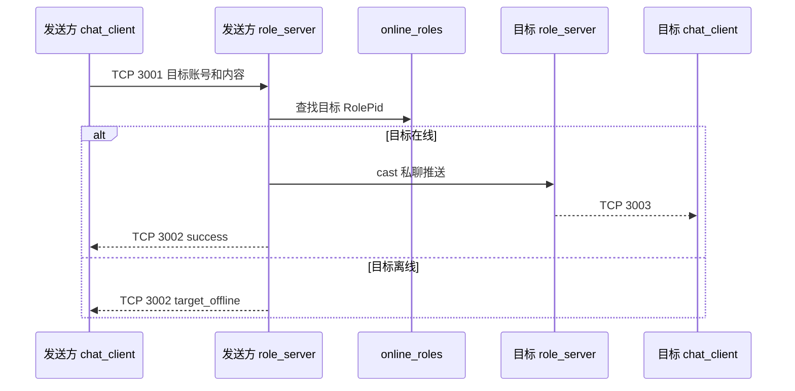
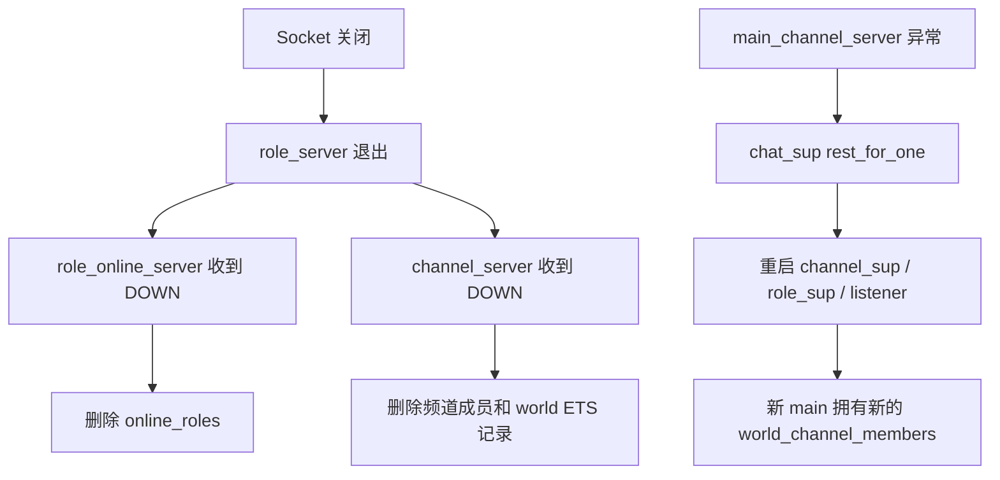

# Chat V1.2 设计文档

## 1. 版本说明

V1.2 是当前维护版本。它在 V1.1 基础上删除了客户端和频道管理中间层，精简了无用状态，并增加了可重复运行的真实 TCP 全链路检查。

docs中的 V1.1 设计和接口文档只作为历史记录保留，不再更新。本文以当前代码和 `./scripts/full_chain_check.sh` 的验证结果为准。

## 2. 当前目标

- 使用 Erlang/OTP 和 `gen_tcp` 实现单节点聊天服务。
- 支持登录、固定频道、世界聊天、公共频道聊天和私聊。
- 每个 TCP 连接由独立 `role_server` 处理。
- 每个压测客户端独立连接、登录并执行自己的行为。
- 保持流程直接，避免只做转发的管理进程。

当前不承诺新的大规模性能数字。旧压测数据来自不同的客户端发送方式，只能作为历史参考。

## 3. 总体架构



主要职责：

| 模块 | 职责 |
|---|---|
| `chat_listener` | 监听端口，接受连接并交给新的 `role_server` |
| `role_online_server` | 保存账号和当前在线角色 |
| `role_server` | 处理一个连接的登录、频道、私聊和 TCP 推送 |
| `channel_server` | 管理固定频道定义和频道成员 |
| `world_broadcast_worker` | 并行处理 `main` 世界频道广播 |
| `chat_client` | 维护一个客户端连接，自行登录和执行行为 |
| `chat_load_test` | 批量启动客户端，并把 Shell 命令直接发给目标客户端 |
| `chat_metrics` | 按需读取连接数、邮箱长度和 BEAM 资源数据 |

## 4. 监督树



`chat_sup` 的子进程顺序很重要。`main_channel_server` 异常时，`rest_for_one` 会同时重启后面的频道监督树、角色监督树和监听器。旧连接会关闭，避免旧角色继续使用一张刚重建的空成员表。

## 5. 状态归属

| 数据 | Owner | 说明 |
|---|---|---|
| `role_accounts` | `role_online_server` | 账号、RoleId 和登录凭据 |
| `online_roles` | `role_online_server` | 当前在线 RoleName 到 RolePid |
| `world_channel_members` | `main_channel_server` | `main` 当前成员，8 个 Worker 只读 |
| 公共频道成员 | 对应 `channel_server` | 保存在进程 State Map 中 |
| 登录角色和已加入频道 | 对应 `role_server` | 只在该连接进程内使用 |

不存在 `channel_manager`、频道资料 ETS、Worker 注册 ETS 或客户端管理 GenServer。

## 6. 主要流程

### 6.1 登录



登录成功后一定加入 `main`，并随机加入 1 到 3 个不同的公共频道。观察者登录后不自动发送。

### 6.2 频道消息



`main` 消息只编码一次，再由 Worker 投递。公共频道消息由目标 `role_server` 分别编码。两条路径都会向频道内的发送者本人推送。

### 6.3 私聊



### 6.4 断线与故障恢复



单个世界 Worker 不存在或调用失败时，发送方收到 `broadcast_failed`，`role_server` 不会因此退出。Worker 恢复后可以继续广播。

## 7. 客户端使用

```erlang
ok = chat_load_test:start_observer().
{ok, 2} = chat_load_test:start(1, 2).
ok = chat_load_test:send_channel(1, 1, <<"hello">>).
ok = chat_load_test:send_private(1, 2, <<"hello">>).
```

- `chat_load_test` 是普通模块，不是进程，也不保存 ClientId 到 PID 的 Map。
- 普通客户端登录成功后每 3000ms 向 `main` 发送一条消息。
- 所有普通客户端使用相同间隔，代码不增加首次错峰。
- observer 只接收并打印频道推送，每秒输出已处理数和无效包数。
- Shell 接口返回 `ok` 只表示命令已交给客户端，不代表服务端业务已经成功。

## 8. 协议摘要

TCP 使用 `[binary, {packet, 4}, {active, true}]`。业务包中的整数使用默认大端序。

| 功能 | 请求 | 返回/推送 |
|---|---:|---:|
| 登录 | 1001 | 1002 |
| 查询频道 | 2001 | 2002 |
| 加入频道 | 2003 | 2004 |
| 退出频道 | 2005 | 2006 |
| 频道聊天 | 2007 | 2008 / 2009 |
| 私聊 | 3001 | 3002 / 3003 |
| 通用错误 | - | 9001 |

具体二进制字段以 `include/chat_protocol.hrl`、`chat_server_protocol` 和 `chat_client_protocol` 为准，避免在文档中维护第二套协议真相。

## 9. 验证方式

```bash
./scripts/compile.sh
./scripts/full_chain_check.sh
```

全链路检查使用系统选择的空闲回环端口，覆盖：

- 登录成功、密码错误、重复在线和未登录请求。
- 频道列表、加入、退出、非法频道和未加入频道。
- 世界频道、公共频道和私聊的实际接收 Packet。
- 目标离线与断线后的 ETS/成员清理。
- 世界 Worker 停止、恢复和 `broadcast_failed`。
- 真实 `chat_client` 的手工发送与三秒自动发送。
- main 异常后的 `rest_for_one` 重启和 ETS owner 恢复。

## 10. 当前限制

- `{active, true}` 没有邮箱背压，过载时消息可能在进程邮箱中积压。
- 每条世界消息仍需遍历全部世界成员，总工作量约为发送者数乘接收者数。
- observer 的打印速度和计数不代表服务端全局吞吐量。
- 当前没有单客户端停止自动循环的公开接口，压测通常通过停止客户端 VM 结束。
- V1.2 功能链路已验证，但新的连接规模和消息负载基线仍需重新测试。
