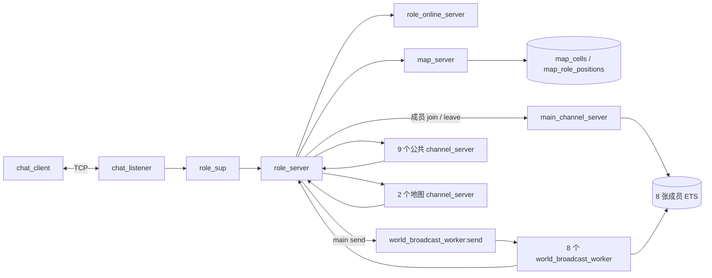
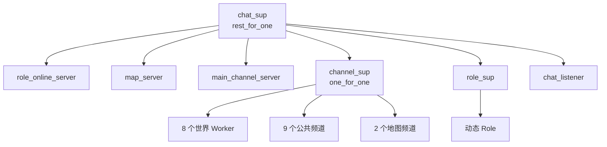
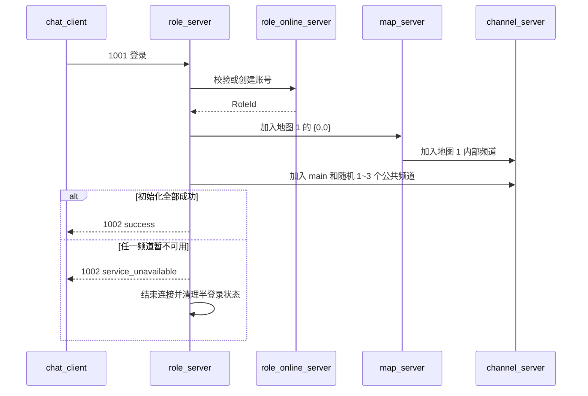
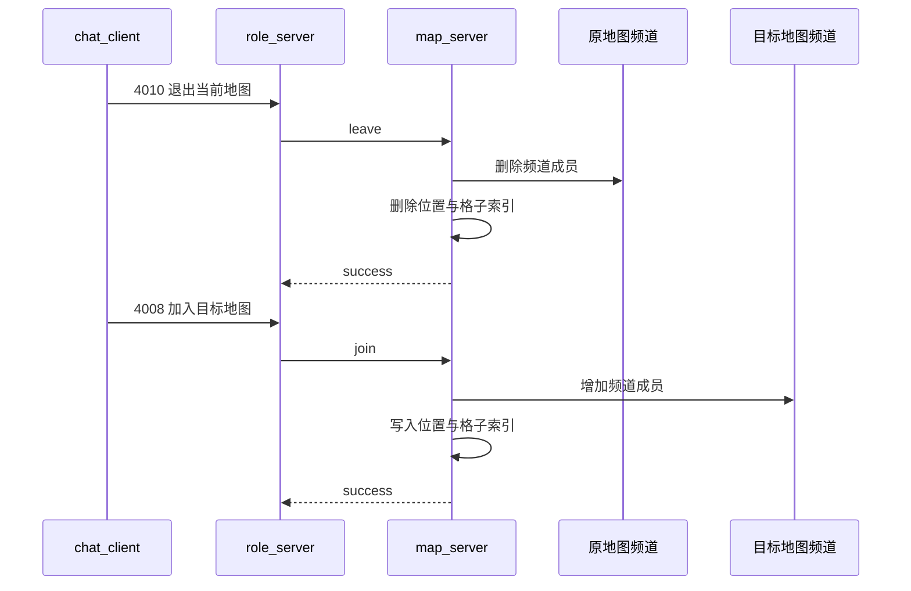
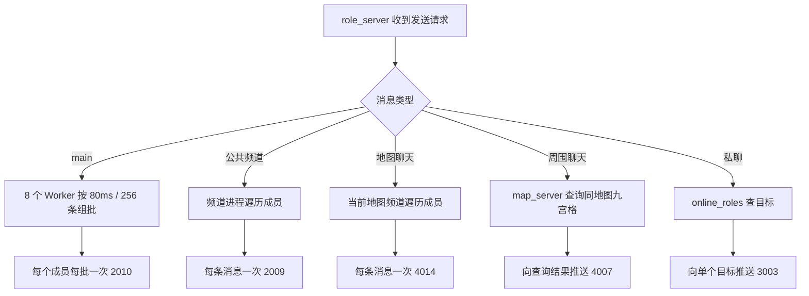
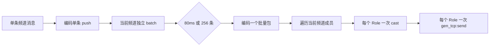

# Chat V1.3 设计文档

## 1. 版本边界

V1.3 在 V1.2 的单节点聊天服务上增加多地图、地图加入/退出、地图聊天、同地图九宫格周围聊天、频道重启恢复和每秒综合压测行为。

- `Chat V1.2 设计文档.md` 保留提交 `b54778d` 时的历史设计。
- 本文对应当前 V1.3 工作树；协议字段和行为以代码及全链路测试为准。
- 全频道批量推送是已确认的下一阶段方案，尚未实现，见第 10 节。

## 2. 目标与边界

当前已经实现：

- 登录、1 个 `main`、9 个公共频道和私聊。
- 两张固定 `100 x 100` 地图，坐标范围为 `0..99`。
- 单地图归属、移动、传送、地图加入/退出和地图聊天。
- 同一地图九宫格查询与周围聊天；边界自动裁剪。
- 公共频道和地图频道重启后的成员恢复。
- 真实 TCP 全链路检查、在线角色明细和七动作压力客户端。

当前不实现动态地图、跨节点分布、AOI 进入/离开通知、消息持久化和应用层心跳。服务端 `packet_size` 保持不变，批量客户端启动失败也不自动回滚。

## 3. 总体架构



| 模块 | 主要职责 |
|---|---|
| `chat_listener` | 接受连接，为每条 Socket 启动一个 `role_server` |
| `role_online_server` | 管理账号和当前在线角色 |
| `role_server` | 保存连接身份、频道、地图和坐标，处理业务协议与 TCP 推送 |
| `map_server` | 串行维护地图加入、退出、移动和九宫格查询 |
| `channel_server` | 管理公共频道或单张地图频道的成员与广播 |
| `world_broadcast_worker` | 为 `main` 分片接收者、组批并广播 |
| `chat_client` | 维护一个真实 TCP 客户端及其本地确认状态 |
| `chat_load_test` | 批量启动客户端和提供 Shell 操作入口 |
| `chat_metrics` | 汇总在线数、邮箱和 BEAM 资源 |

## 4. 监督与状态



`chat_sup` 的子进程顺序是状态依赖顺序。`map_server` 或 `main_channel_server` 崩溃时，`rest_for_one` 会重启下游频道、Role 和监听器，避免存活连接继续使用重建后的空 ETS。

| 状态 | Owner | 结构与约束 |
|---|---|---|
| `role_accounts`、`online_roles` | `role_online_server` | 账号与在线 RolePid |
| `map_cells` | `map_server` | `bag`：`{MapId,X,Y} -> RolePid` |
| `map_role_positions` | `map_server` | `set`：`RolePid -> {MapId,{X,Y}}`，保证单地图归属 |
| `main` 成员 | `main_channel_server` | RoleId 哈希到 8 张唯一成员 ETS |
| 公共/地图频道成员 | 对应 `channel_server` | 进程 State 中的成员 Map 与 monitor |
| 身份、频道、地图、坐标 | 对应 `role_server` | 只在当前连接进程中使用 |
| 客户端确认状态 | 对应 `chat_client` | 只在服务端成功结果后更新 |

## 5. 主要流程

### 5.1 登录



登录成功后，角色一定属于地图 `1`，并加入 `main` 和随机 1～3 个公共频道。

### 5.2 切换地图



客户端切图按 TCP 顺序发送退出和加入。频道调用失败时，本次状态变更不提交：退出失败保留原地图；目标加入失败则保持未加入地图。

### 5.3 消息路由



地图频道是内部频道，客户端不能把它当作普通频道手工加入。地图聊天和周围聊天都由 `role_server` 使用自身 `MapId`，不信任客户端提供成员身份。

## 6. 频道不可用与恢复

普通频道和地图频道的同步调用统一经过 `channel_server:channel_call/2`。目标进程停止或重启时，调用返回显式错误，而不是让调用者随 `gen_server:call` exit：

- 普通频道返回 `channel_unavailable`。
- 地图加入、退出和聊天返回 `map_unavailable`。
- 登录初始化返回 `service_unavailable` 并结束当前 Role。
- 失败路径不修改地图 ETS、Role 状态或客户端缓存。

公共/地图频道重启后会通知在线 Role；每个 Role 只按自己的 `channel_ids` 或 `MapId` 恢复成员。200 个活跃客户端已对地图 1/2 各完成 4 轮频道重启测试，期间 `map_server` PID 和在线数保持不变，四份状态最终一致。

## 7. 协议摘要

TCP 使用 `[binary, {packet,4}, {active,true}]`，业务整数为大端序。

| 功能 | 请求 | 返回/推送 |
|---|---:|---:|
| 登录 | 1001 | 1002 |
| 查询/加入/退出频道 | 2001 / 2003 / 2005 | 2002 / 2004 / 2006 |
| 频道聊天 | 2007 | 2008 / 2009 / 2010 |
| 私聊 | 3001 | 3002 / 3003 |
| 移动 | 4001 | 4002 |
| 传送 | 4003 | 4004 |
| 周围聊天 | 4005 | 4006 / 4007 |
| 加入地图 | 4008 | 4009 |
| 退出地图 | 4010 | 4011 |
| 地图聊天 | 4012 | 4013 / 4014 |
| 通用错误 | - | 9001 |

具体字段以 `include/chat_protocol.hrl`、`chat_server_protocol` 和 `chat_client_protocol` 为唯一真相。当前 `2010` 只能批量包装 `2009` 普通频道推送，不能直接包装 `4014` 地图推送。

## 8. 客户端与观测

```erlang
ok = chat_load_test:start_observer().
{ok, 2000} = chat_load_test:start(1, 2000).
chat_metrics:snapshot().
chat_metrics:print_online_clients().
```

- `normal` 登录后每 `1000ms` 在频道聊天、私聊、移动、传送、周围聊天、地图聊天和切图中等概率选择一个动作。
- `start_map/2` 每 `1000ms` 按 50% 移动、50% 周围聊天执行定向地图负载。
- 客户端没有首次随机错峰；Shell 命令返回 `ok` 只表示已投递给客户端进程。
- `snapshot/0` 当前统计 Role、频道和世界 Worker 邮箱，但尚未统计 `map_server` 邮箱。

## 9. 验证与容量结论

```bash
./scripts/compile.sh
./scripts/full_chain_check.sh
```

全链路测试覆盖登录、频道、私聊、世界批量包、多地图隔离、移动、传送、九宫格、地图聊天、地图加入/退出、频道不可用、成员恢复和断线清理。

| 负载 | 结果 |
|---|---|
| 七动作 100 / 300 / 500，每档 8 秒 | 通过；500 档约 61.68 MiB，采样邮箱峰值为 0 |
| 七动作目标 6000 | 未通过；约 3000 在线开始持续积压，约 4458 在线时不可恢复 |
| 旧 V1.2 每 3 秒聊天负载 10000 | 历史结果通过，但不能代表当前七动作容量 |

6000 尝试中，`role_queue_total` 随在线数从 `656@2722` 增长到 `83953@3099`、`856588@3811` 和 `5240719@4458`；最后一次采样内存约 3051 MiB。Linux 随后在 `beam.smp` 匿名内存约 4.98 GiB 时触发 OOM Kill。

当前机器和负载下的明显拐点约为 2800～3200 在线，2000 是更有余量的持续验证档位，不是生产容量承诺。服务端退出后的 `econnrefused` 是 OOM 的结果。

## 10. 下一阶段：全频道批量推送（计划中）



迁移原则：

1. `main` 保留现有 8 Worker，不建立新的全局广播进程。
2. 普通频道和地图频道在各自 `channel_server` 内独立维护 batch。
3. 复用服务端批量封包、客户端长度校验和 Role 通用批量 TCP 发送路径。
4. 地图聊天增加独立批量推送类型；私聊和九宫格周围聊天不纳入本次改造。
5. join/leave 前先 flush，保持成员变化前后的消息边界。
6. 批量化后补充 `map_server` mailbox 指标；只有地图调用仍持续排队时才按 `MapId` 分片。

该方案降低 Role mailbox 事件、重复编码和 TCP send 次数，但不会消除广播总业务字节的 O(N^2) 增长，也不保证单项改造后即可稳定承载 6000 客户端。

## 11. 当前限制

- `{active,true}` 没有接收背压，过载时会把压力转移到进程邮箱。
- 公共和地图频道仍是逐消息、逐成员推送，是当前首要容量问题。
- 单一 `map_server` 串行处理所有地图的 join、leave、relocate 和 nearby。
- 世界、公共和地图广播的总业务字节仍随发送者数乘接收者数增长。
- 成功响应不承诺接收者已收到，内存中的未发送消息也不持久化。
- 没有应用层心跳；大批连接退出时可能产生大量 Supervisor/logger 日志。
