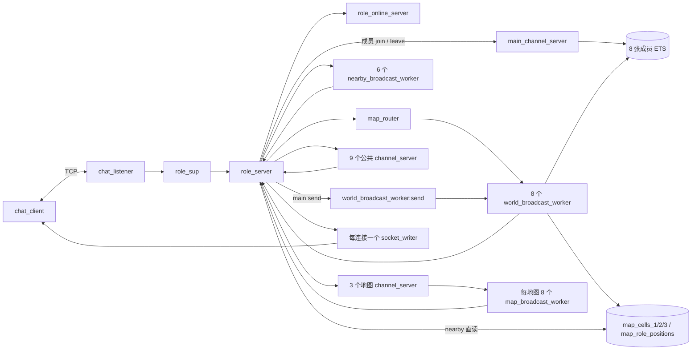
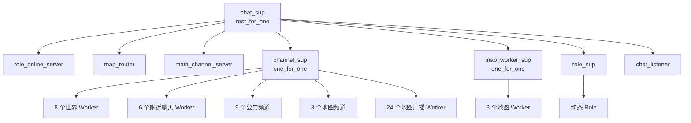
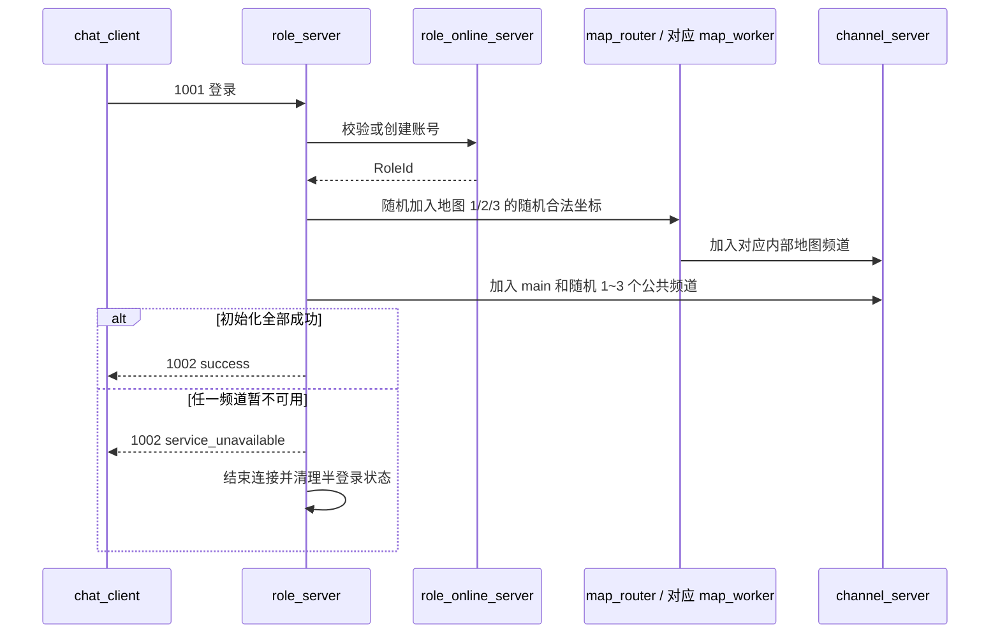
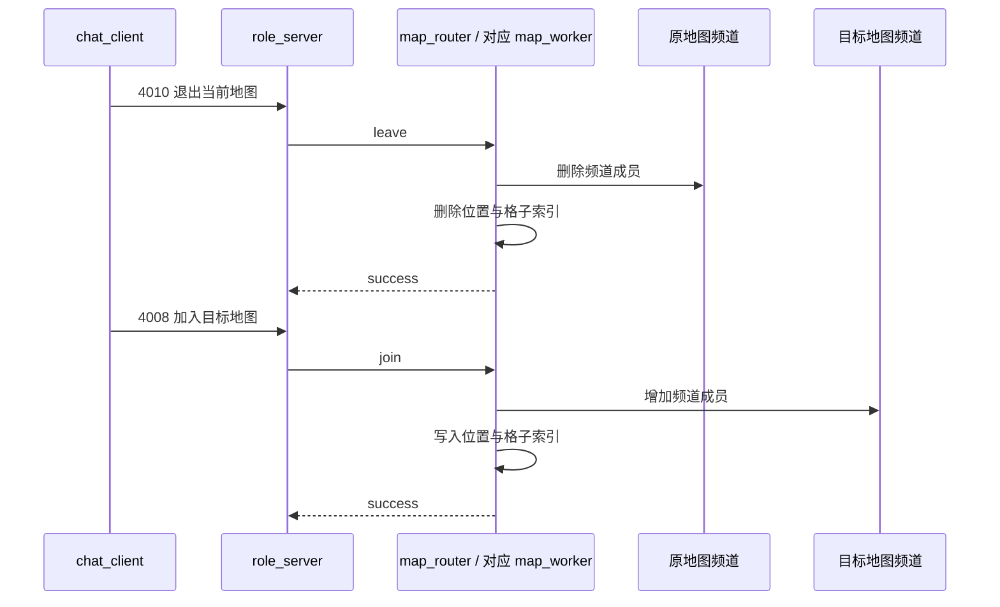
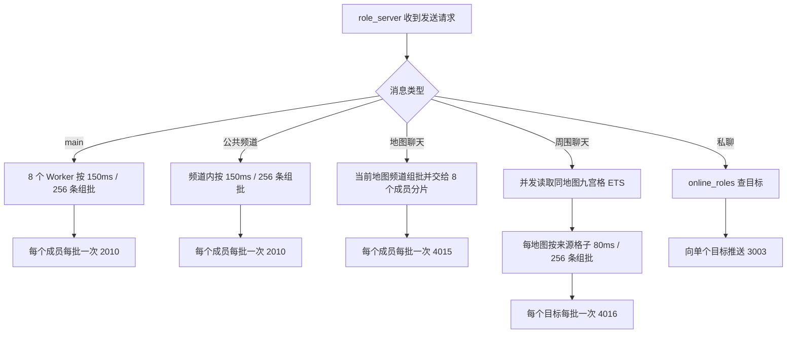
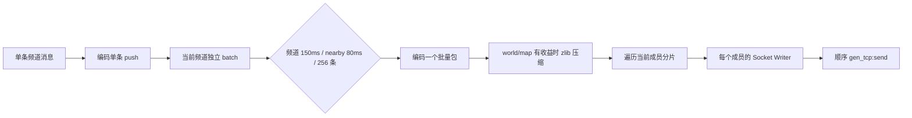

# Chat V1.3 设计文档

## 1. 版本边界

V1.3 在 V1.2 的单节点聊天服务上增加多地图、地图加入/退出、地图聊天、同地图九宫格周围聊天、频道重启恢复和每秒综合压测行为。

- `Chat V1.2 设计文档.md` 保留提交 `b54778d` 时的历史设计。
- 本文对应当前 V1.3 工作树；协议字段和行为以代码及全链路测试为准。
- 公共频道和地图频道批量推送已实现，见第 10 节。

## 2. 目标与边界

当前已经实现：

- 登录、1 个 `main`、9 个公共频道和私聊。
- 三张固定 `100 x 100` 地图，坐标范围为 `0..99`。
- 单地图归属、移动、传送、地图加入/退出和地图聊天。
- 同一地图九宫格查询与周围聊天；边界自动裁剪。
- 公共频道和地图频道重启后的成员恢复。
- `main`、公共频道和地图频道按频道独立批量推送，世界和地图批包按收益压缩。
- 每条连接由独立 Socket Writer 顺序发送响应和广播。
- 真实 TCP 全链路检查、在线角色明细和七动作压力客户端。

当前不实现动态地图、跨节点分布、AOI 进入/离开通知、消息持久化和应用层心跳。服务端 `packet_size` 保持不变，批量客户端启动失败也不自动回滚。

## 3. 总体架构



| 模块 | 主要职责 |
|---|---|
| `chat_listener` | 接受连接，为每条 Socket 启动一个 `role_server` |
| `role_online_server` | 管理账号和当前在线角色 |
| `role_server` | 保存连接身份、频道、地图和坐标，处理业务协议与 TCP 推送 |
| `map_router` | 持有共享位置/格子 ETS，按 `MapId` 直接调用对应 Worker，不经 Router 进程邮箱 |
| `map_worker` | 每张地图一个进程，并行处理该地图的加入、退出、移动和传送 |
| `channel_server` | 管理公共/地图频道成员，并按 `150ms/256` 组批广播 |
| `world_broadcast_worker` | 为 `main` 分片接收者、组批并广播 |
| `map_broadcast_worker` | 每地图 8 路维护成员分片并执行地图聊天 fan-out |
| `nearby_broadcast_worker` | 每地图 2 路按来源格子组批周围聊天 |
| `socket_writer` | 每连接顺序执行 TCP 发送，使 Role 不被广播发送阻塞 |
| `chat_client` | 维护一个真实 TCP 客户端及其本地确认状态 |
| `chat_load_test` | 批量启动客户端和提供 Shell 操作入口 |
| `chat_metrics` | 汇总在线数、邮箱和 BEAM 资源 |

## 4. 监督与状态



`chat_sup` 的子进程顺序是状态依赖顺序。`map_router` 或 `main_channel_server` 崩溃时，`rest_for_one` 会重启下游频道、地图 Worker、Role 和监听器，避免存活连接继续使用重建后的空 ETS。单个 `map_worker` 崩溃时只重启该 Worker，并从共享位置 ETS 恢复本地图格子和 Role monitor；移动与恢复共用该 Worker 的串行边界，避免位置表和格子表留下旧坐标。

| 状态 | Owner | 结构与约束 |
|---|---|---|
| `role_accounts`、`online_roles` | `role_online_server` | 账号与在线 RolePid |
| `map_cells_1/2/3` | `map_router` | 每地图一个 `bag`：`{MapId,X,Y} -> {RolePid,Writer}` |
| `map_role_positions` | `map_router` | `set`：`RolePid -> {MapId,{X,Y}}`，保证单地图归属 |
| `main` 成员 | `main_channel_server` | RoleId 哈希到 8 张唯一成员 ETS |
| 公共频道成员 | 对应 `channel_server` | 进程 State 中的成员 Map 与 monitor |
| 地图频道成员 | 对应 `channel_server` / `map_broadcast_worker` | RoleId 哈希到每地图 8 张 ETS；Worker 保留本分片内存副本 |
| 身份、频道、地图、坐标 | 对应 `role_server` | 只在当前连接进程中使用 |
| 客户端确认状态 | 对应 `chat_client` | 只在服务端成功结果后更新 |

## 5. 主要流程

### 5.1 登录



登录成功后，角色属于随机选择的地图 `1`、`2` 或 `3`，并加入 `main` 和随机 1～3 个公共频道。

### 5.2 切换地图



客户端切图按 TCP 顺序发送退出和加入，每次成功加入都会在目标地图的
`0..99 x 0..99` 范围内重新随机出生。频道调用失败时，本次状态变更不提交：
退出失败保留原地图；目标加入失败则保持未加入地图。

### 5.3 消息路由



地图频道是内部频道，客户端不能把它当作普通频道手工加入。地图聊天和周围聊天都由 `role_server` 使用自身 `MapId`，不信任客户端提供成员身份。

地图频道进程按顺序向分片 Worker 投递广播和 leave。leave 先从频道逻辑成员与 ETS 删除，目标 Worker 再按 FIFO 处理此前广播、发送当前尾批并删除本地成员；因此地图写路径不等待历史 fan-out，同时保持离开前消息边界。Worker 重启从 ETS 恢复成员，频道 owner 标识会过滤旧频道遗留消息。

## 6. 频道不可用与恢复

普通频道和地图频道的同步调用统一经过 `channel_server:channel_call/2`。目标进程停止或重启时，调用返回显式错误，而不是让调用者随 `gen_server:call` exit：

- 普通频道返回 `channel_unavailable`。
- 地图加入、退出和聊天返回 `map_unavailable`。
- 登录初始化返回 `service_unavailable` 并结束当前 Role。
- 失败路径不修改地图 ETS、Role 状态或客户端缓存。
- 频道请求携带单调时钟截止时间；调用超时返回后，旧请求即使稍后出队也只返回不可用、不执行业务副作用。

公共/地图频道重启后会通知在线 Role；每个 Role 只按自己的 `channel_ids` 或 `MapId` 恢复成员。200 个活跃客户端已对地图 1/2 各完成 4 轮频道重启测试，期间地图路由 PID 和在线数保持不变，四份状态最终一致。

地图 Worker 请求也携带单调时钟截止时间，并与内部地图频道调用共用同一预算。请求超时后出队不会迟到写入；join 使用临时 pending 状态，Worker 在中途崩溃时会清理半完成的位置和频道成员。

## 7. 协议摘要

TCP 使用 `[binary, {packet,4}, {active,true}]`，业务整数为大端序。

| 功能 | 请求 | 返回/推送 |
|---|---:|---:|
| 登录 | 1001 | 1002 |
| 查询/加入/退出频道 | 2001 / 2003 / 2005 | 2002 / 2004 / 2006 |
| 频道聊天 | 2007 | 2008 / 2009 / 2010 |
| 私聊 | 3001 | 3002 / 3003 |
| 移动 | 4001 | 4002 |
| 传送 | 4003 | 4004 |
| 周围聊天 | 4005 | 4006 / 4007 / 4016 |
| 加入地图 | 4008 | 4009 |
| 退出地图 | 4010 | 4011 |
| 地图聊天 | 4012 | 4013 / 4014 / 4015 |
| 通用错误 | - | 9001 |

具体字段以 `include/chat_protocol.hrl`、`chat_server_protocol` 和 `chat_client_protocol` 为唯一真相。`2010` 只包装 `2009` 普通频道推送，`4015` 只包装 `4014` 地图推送，`4016` 只包装 `4007` 周围聊天推送；客户端会校验批内消息类型和长度。

## 8. 客户端与观测

```erlang
ok = chat_load_test:start_observer().
{ok, 2000} = chat_load_test:start(1, 2000).
chat_metrics:snapshot().
chat_metrics:print_online_clients().
```

- `normal` 登录后每 `1000ms` 在频道聊天、私聊、移动、传送、周围聊天、地图聊天和切图中等概率选择一个动作。
- `start_map/2` 每 `1000ms` 按 50% 移动、50% 周围聊天执行定向地图负载。
- 客户端没有首次随机错峰；Shell 命令返回 `ok` 只表示已投递给客户端进程。
- `snapshot/0` 统计 Role、Socket Writer、频道、三个地图 Worker、世界/地图/附近广播 Worker 邮箱，以及地图操作、逻辑/线上字节和发送失败。

## 9. 验证与历史容量结论

```bash
./scripts/compile.sh
./scripts/full_chain_check.sh
```

全链路测试覆盖登录、频道、私聊、世界/公共/地图/周围聊天批量包、批内顺序、256 条满批、成员变化边界、多地图隔离、移动、传送、九宫格、频道超时与不可用、Worker/成员恢复和断线清理。

| 负载 | 结果 |
|---|---|
| 七动作 100 / 300 / 500，每档 8 秒 | 通过；500 档约 61.68 MiB，采样邮箱峰值为 0 |
| 七动作 4000 | 通过；到齐后稳定超过 60 秒，关键邮箱无持续积压 |
| 七动作 5000 / 6000（随机出生，优化中间版） | 分别稳定 120 / 60 秒，关键队列可回落 |
| 七动作 7000（随机出生，优化中间版） | Role 邮箱持续积压，主动止损 |
| 七动作 10000（当前 V1.3） | 10000 个真实 TCP 客户端全部到齐并持续活跃 120 秒，门禁通过 |
| 旧 V1.2 每 3 秒聊天负载 10000 | 历史结果通过，但不能代表当前七动作容量 |

正式门禁使用本机回环 TCP、每客户端每 `1000ms` 七选一动作。0～120 秒共 25 个稳态样本的在线数均为 10000；`world/map/nearby_send_failures` 和 `socket_send_pend_total/max` 全部为 0。Role 和地图队列存在可回落的明显脉冲，峰值分别为 8092 和 3880，120 秒样本仍为 5653 和 3151，不能表述为全程无积压。服务端内存后段约在 453～496 MiB 波动，末值 463 MiB，未持续失控；join/leave 最大延迟约 391/111ms。门禁通过后的 SIGTERM 清理产生大量 `closed/einval` 日志，不属于稳态发送失败。

## 10. 全频道批量推送



当前实现：

1. `main` 保留现有 8 Worker，不建立新的全局广播进程。
2. 普通频道和地图频道在各自 `channel_server` 内独立维护 batch；地图 fan-out 使用每地图 8 个成员分片 Worker。
3. 复用服务端批量封包、客户端长度校验和每连接 Socket Writer；world/map 批包仅在压缩后更小时发送压缩包。
4. 地图聊天增加独立批量推送类型；周围聊天由每地图 2 个 Worker 按来源格子组批，私聊仍保持单条推送。
5. join 记录当前批次偏移，leave 只向离开者发送其应收后缀；成员变化不再触发全员 flush。
6. `chat_metrics:snapshot/0` 已补充三个地图 Worker、附近 Worker、地图操作和批量指标。

该实现降低 Role mailbox 事件、线上字节、重复编码和 TCP send 次数；当前七动作 10000 客户端 120 秒门禁已通过，但广播逻辑工作量仍随发送者数乘接收者数增长。

## 11. 当前限制

- `{active,true}` 没有接收背压，过载时会把压力转移到进程邮箱。
- 10000/120 秒是本机回环 TCP 的当前门禁结果，不是跨机器或生产容量承诺。
- 每张地图内部仍由一个 Worker 串行处理 join、leave 和 relocate；这样也避免 Worker 重启恢复与移动并发写双 ETS 留下旧格。不同地图可以并行，nearby 使用 ETS 并发快照，移动瞬间允许短暂漏收或多收。
- 共享地图 ETS 为内部公开表，使不同地图的三个 Worker 可以并发写各自状态；当前没有第三方 BEAM 代码隔离边界。
- 世界、公共和地图广播的总业务字节仍随发送者数乘接收者数增长。
- 成功响应不承诺接收者已收到，内存中的未发送消息也不持久化；地图 leave 入队后分片 Worker 若立即崩溃，离开尾批可能丢失。
- 10000 门禁仍观察到 Role/地图队列脉冲与偶发高尾延迟，后续只有更长稳态或更严格延迟目标才需要继续优化。
- 没有应用层心跳；大批连接退出时可能产生大量 Supervisor/logger 日志。
